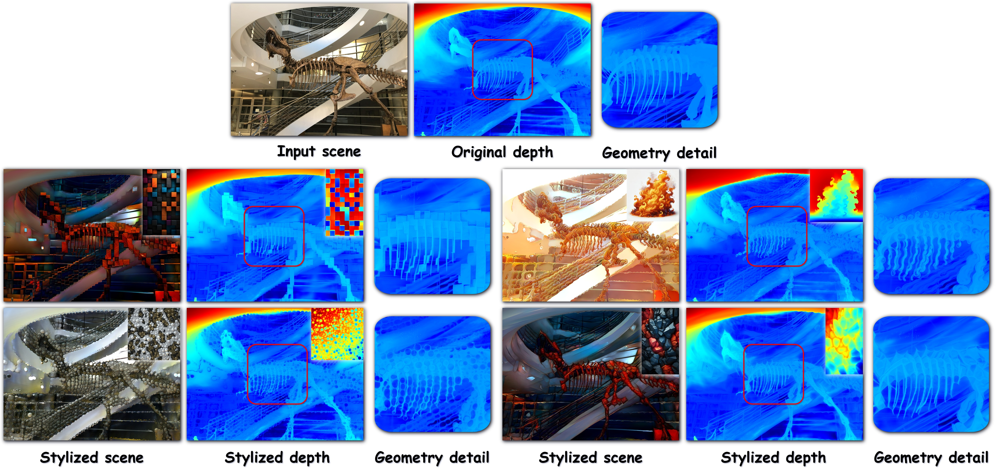

# Geometry-Aware Style Transfer in 3D Gaussian Splatting


</div>

we present a novel geometry-aware style transfer framework for 3D Gaussian splatting (3DGS) that simultaneously transfers appearance attributes and geometric structures. Unlike prior works that primarily focus on color-based stylization and often overlook structural adaptation, our method explicitly incorporates geometry adaptation through a decoupled optimization scheme that alternately updates color and geometry parameters. This strategy alleviates potential interference between color and geometry updates, leading to stable and consistent scene-level geometry transformation. The decoupled optimization is enabled by the proposed geometry-aware contrastive feature matching (GCFM). GCFM integrates RGB, depth, and edge cues into a contrastive objective and is employed in both optimization phases to effectively transfer structural characteristics from style images to Gaussian primitives. Extensive experiments show that our approach achieves superior performance in both qualitative fidelity and quantitative metrics, significantly outperforming existing 3DGS-based stylization methods.

## Setup

### Installation
Clone the repository and install necessary dependencies：

```bash
git clone https://github.com/oweixx/gast.git
conda env create --file environment.yml
conda activate gast

git clone https://github.com/DepthAnything/Depth-Anything-V2
mv Depth-Anything-V2 Depth_Anything_V2
wget -O depth_anything_v2_vitl.pth "https://huggingface.co/depth-anything/Depth-Anything-V2-Large/resolve/main/depth_anything_v2_vitl.pth?download=true"
mkdir -p checkpoints
mv depth_anything_v2_vitl.pth checkpoints/
```

### Data Preparation
We evaluate the dataset on [LLFF](https://bmild.github.io/llff/), [Tanks and Temples](https://www.tanksandtemples.org/) and [MipNeRF-360](https://jonbarron.info/mipnerf360/) datasets. For convenience, a small subset of preprocessed scene data and reference style images is provided [here](https://drive.google.com/file/d/1U7MTzKAFNY0XbJ4tnr8BwsFHKbedOOyw/view?usp=sharing).

To use custom data, please follow the instructions in [3DGS](https://github.com/graphdeco-inria/gaussian-splatting/blob/54c035f7834b564019656c3e3fcc3646292f727d/README.md#processing-your-own-scenes) to process your own scenes.

The `datasets` folder is organized as follows:
```bash
datasets
|---llff
|   |---flower
|   |---horns
|   |---...
|---tandt
|---mipnerf360
|---styles
|   |---0.jpg
|   |---1.jpg
|   |---...
```

## Quick Start
This repository provides a batch pipeline for stylizing multiple 3D Gaussian Splatting (3DGS) scenes with various reference styles.  
The included shell script automatically performs:

1. 3DGS training + stylization  
2. Depth video rendering  
3. Final RGB video rendering

---

To run the full stylization pipeline across all predefined scenes and styles, simply execute:

```bash
bash scripts/run.sh
```

The script iterates through:

- **Scenes:** `trex`, `flower`, `horns`, `fern`
- **Styles:** images located in `style/`
- **Output directory:**
  ```
  output/[date]/[purpose]/[scene]/[style]/
  ```

---

## What the Script Does

For each `(scene, style)` pair, the following steps are executed:

### 1. Train & Stylize (`train.py`)

- Loads the scene from `${scene_dir}/${scene}`
- Loads the point cloud from:
  ```
  iteration_30000/point_cloud.ply
  ```
- Applies the style image:
  ```
  ${style_dir}/${style}.jpg
  ```
- Saves the stylized 3DGS result under:
  ```
  output/[date]/[purpose]/[scene]/[style]/
  ```

### 2. Render Depth Video (`depth_render_video.py`)

Generates a spiral-view depth visualization video of the stylized scene.

### 3. Render RGB Video (`render_video.py`)

Produces the final stylized spiral-view RGB animation.

---

## 🔧 Customizing the Pipeline

You can modify the following variables inside `scripts/run.sh`:

| Variable      | Description |
|---------------|-------------|
| `cuda`        | GPU index used during execution |
| `date`        | Experiment group identifier |
| `purpose`     | Project name or experiment tag |
| `scene_list`  | Scenes to be processed |
| `style_list`  | Style images to apply |
| `scene_dir`   | Directory containing original 3DGS scenes |
| `style_dir`   | Directory containing style images |

### Example Modification

```bash
scene_list=("trex")
style_list=("starry" "mosaic")
```

This will process:

- `trex` with `starry`
- `trex` with `mosaic`

---