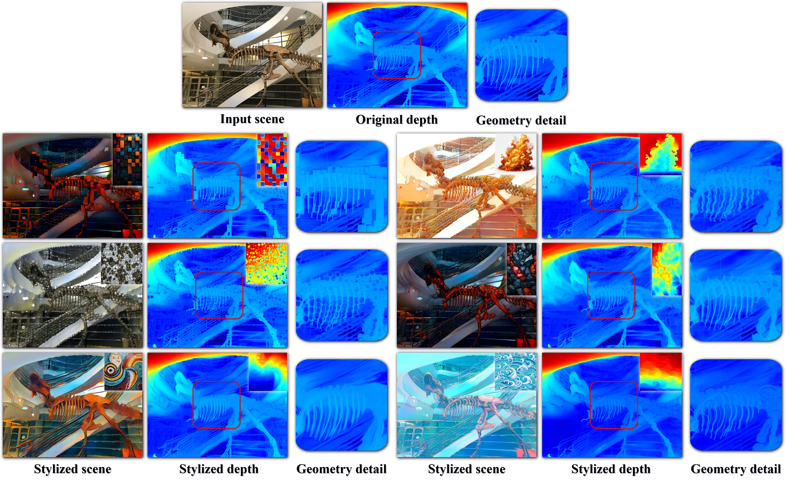

<h1 align="center">Geometry-Aware Style Transfer in 3D Gaussian Splatting</h1>

<p align="center">
  <a href="https://oweixx.github.io/">Min Hyeok Bang</a><sup>*1</sup>,
  <a href="https://kjun627.github.io/">Jun Hyeong Kim</a><sup>*1</sup>,
  <a href="https://gymlab.github.io/">Seung-Wook Kim</a><sup>†2</sup>,
  <a href="https://jbnu-vilab.github.io/people/">Se-Ho Lee</a><sup>†1</sup>
</p>

<p align="center">
  <sup>1</sup>Department of Computer Science and Artificial Intelligence/Center for Advanced
Image Information Technology, Jeonbuk National University, Jeonju-si, South Korea,
  <sup>2</sup>Division of Electronic and Communication Engineering, Pukyong National
University, Busan, South Korea
</p>

<p align="center">
  <sup>*</sup>These authors contributed equally,
  <sup>†</sup>Corresponding authors
</p>

<p align="center">
  <strong>ECCV 2026</strong>
</p>

<!-- <p align="center">
  <a href="https://arxiv.org/abs/2601.07603">
    
  </a>
  <a href="https://zijian-wu.github.io/uika-page/">
    
  </a>
</p> -->

<div align=center>
  
</div>

<!-- > We present Geometry-Aware Style Transfer in 3D Gaussian Splatting -->

## Setup

### Installation
Clone the repository and install necessary dependencies：

```bash
git clone https://github.com/oweixx/gast.git
conda env create --file environment.yml
conda activate gast

git clone https://github.com/DepthAnything/Depth-Anything-V2
mv Depth-Anything-V2 Depth_Anything_V2
wget -O depth_anything_v2_vitl.pth "https://huggingface.co/depth-anything/Depth-Anything-V2-Large/resolve/main/depth_anything_v2_vitl.pth?download=true"
mkdir -p checkpoints
mv depth_anything_v2_vitl.pth checkpoints/
```

### Data Preparation
We evaluate the dataset on [LLFF](https://bmild.github.io/llff/), [Tanks and Temples](https://www.tanksandtemples.org/) and [MipNeRF-360](https://jonbarron.info/mipnerf360/) datasets. For convenience, a small subset of preprocessed scene data and reference style images is provided `./style` folder.

To use custom data, please follow the instructions in [3DGS](https://github.com/graphdeco-inria/gaussian-splatting/blob/54c035f7834b564019656c3e3fcc3646292f727d/README.md#processing-your-own-scenes) to process your own scenes.

The `datasets` folder is organized as follows:
```bash
datasets
|---llff
|   |---flower
|   |---horns
|   |---...
|---tandt
|---mipnerf360
```

## 3DGS Reconstruction (Generating Point Clouds)

Our stylization pipeline assumes that each scene has already been reconstructed as a 3D Gaussian Splatting (3DGS) model and contains a pre-trained point cloud. In this repository, we provide an original 3DGS reconstruction script:

- `original_train.py`: reconstructs a 3DGS scene and saves the Gaussian point cloud.  
  For details on the training procedure, please refer to the original 3DGS repo:  
  [3DGS – Running](https://github.com/graphdeco-inria/gaussian-splatting/blob/54c035f7834b564019656c3e3fcc3646292f727d/README.md#Running)


### 1. Prepare COLMAP-processed input

First, preprocess your scenes following the official 3DGS pipeline:

- Camera poses and images should be prepared as in the original 3DGS repository.  
- Please refer to the official instructions for processing your own scenes:  
  [3DGS – Processing your own scenes](https://github.com/graphdeco-inria/gaussian-splatting/blob/54c035f7834b564019656c3e3fcc3646292f727d/README.md#processing-your-own-scenes)

## Quick Start
This repository provides a batch pipeline for stylizing multiple 3D Gaussian Splatting (3DGS) scenes with various reference styles.  
The included shell script automatically performs:

1. 3DGS geometry-aware stylization  
2. Depth video rendering  
3. Final RGB video rendering

To run the full stylization pipeline across all predefined scenes and styles, simply execute:

```bash
bash scripts/run.sh
```

The script iterates through:

- **Scenes:** `trex`, `flower`, `horns`, `fern`
- **Styles:** images located in `style/`
- **Output directory:**
  ```
  output/[date]/[purpose]/[scene]/[style]/
  ```
  
## What the Script Does

For each `(scene, style)` pair, the following steps are executed:

### 1. Train & Stylize (`train.py`)

- Loads the scene from `${scene_dir}/${scene}`
- Loads the point cloud from:
  ```
  iteration_30000/point_cloud.ply
  ```
- Applies the style image:
  ```
  ${style_dir}/${style}.jpg
  ```
- Saves the stylized 3DGS result under:
  ```
  output/[date]/[purpose]/[scene]/[style]/
  ```

### 2. Render Depth Video (`depth_render_video.py`)

Generates a spiral-view depth visualization video of the stylized scene.

### 3. Render RGB Video (`render_video.py`)

Produces the final stylized spiral-view RGB animation.

## Customizing the Pipeline

You can modify the following variables inside `scripts/run.sh`:

| Variable      | Description |
|---------------|-------------|
| `cuda`        | GPU index used during execution |
| `date`        | Experiment group identifier |
| `purpose`     | Project name or experiment tag |
| `scene_list`  | Scenes to be processed |
| `style_list`  | Style images to apply |
| `scene_dir`   | Directory containing original 3DGS scenes |
| `style_dir`   | Directory containing style images |

### Example Modification

```bash
scene_list=("trex")
style_list=("starry" "mosaic")
```

This will process:

- `trex` with `starry`
- `trex` with `mosaic`

## Citation

If you find this project useful, please cite:

```bibtex
@inproceedings{wu2026uika,
    title     = {UIKA: Fast Universal Head Avatar from Pose-Free Images},
    author    = {Wu, Zijian and Zhou, Boyao and Hu, Liangxiao and Liu, Hongyu and Sun, Yuan and Wang, Xuan and Cao, Xun and Shen, Yujun and Zhu, Hao},
    booktitle = {Proceedings of the IEEE/CVF Conference on Computer Vision and Pattern Recognition},
    year      = {2026}
}
```
